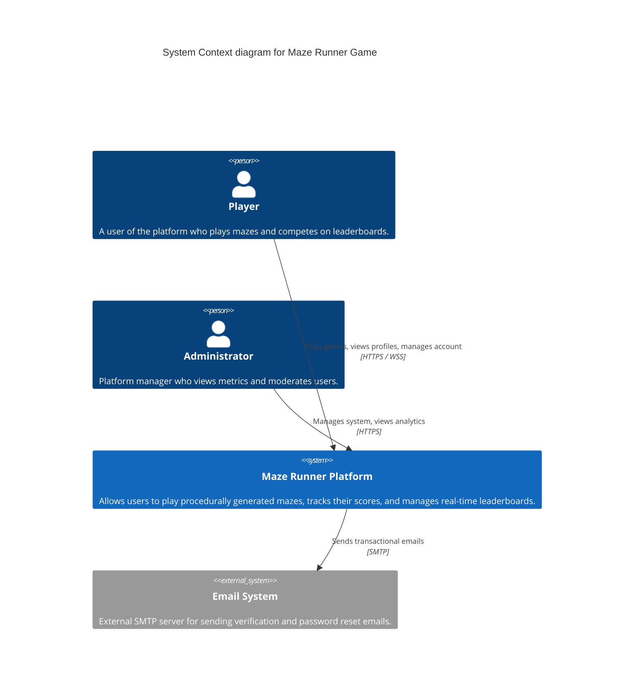
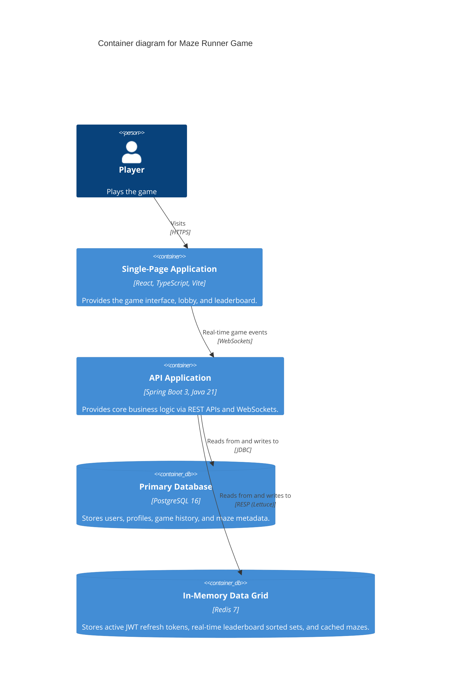

# Architecture

## 1. System Overview

The Maze Runner Game is an enterprise-grade full-stack platform designed for procedural maze generation, real-time gameplay tracking, leaderboards, and achievement systems. 

It uses a microservices-ready monolithic architecture, cleanly separating the React SPA frontend from the Spring Boot REST API. 

## 2. Context Diagram (C4 Level 1)

## 3. Container Diagram (C4 Level 2)

## 4. Backend Design: Clean Architecture

The backend follows Domain-Driven Design (DDD) layered via Clean Architecture principles.

1. **Domain Layer (`com.mazerunner.domain`)**: Contains aggregate roots (e.g., `User`, `Maze`, `GameSession`), value objects, and domain services. NO dependencies on Spring or JPA annotations outside of standard Java. *(Note: Pragmatism allows JPA annotations on entities here to reduce boilerplate mapping, but business logic remains pure).*
2. **Application Layer (`com.mazerunner.application`)**: Application services (Use Cases) orchestrating domain objects, transaction management.
3. **Infrastructure Layer (`com.mazerunner.infrastructure`)**: Implementations of database repositories (Spring Data JPA), Redis caching, Spring Security, external integrations.
4. **Presentation Layer (`com.mazerunner.presentation`)**: REST Controllers, WebSocket handlers, DTOs, and global exception handlers.

## 5. Technology Stack Decisions

| Technology | Role | Rationale |
|---|---|---|
| **Java 21 + Spring Boot 3.3** | Backend Framework | Virtual threads for high concurrency WebSocket scaling, robust ecosystem, mature security. |
| **PostgreSQL 16** | Relational DB | ACID compliance, JSONB support for flexible maze grid storage, robust indexing. |
| **Redis 7** | Cache & Fast Data | Fast JWT token revocation checks, O(log N) sorted sets for real-time leaderboards. |
| **React 18 + TypeScript 5** | Frontend Framework | Strict typing prevents runtime bugs; React provides excellent component reusability. |
| **Zustand + React Query** | State Management | Zustand for global UI state; Query for server state, caching, and background syncing. |
| **Tailwind CSS + clsx** | Styling | Rapid, consistent styling without leaving the component context. Custom theme support. |

## 6. Database Design

- `users`: Core identity, BCrypt hashes, RBAC.
- `refresh_tokens`: Hashes of refresh tokens mapped to `user_id` for rotation.
- `player_profiles`: 1:1 with users, tracks aggregates (total score, games won) for fast querying.
- `mazes`: Metadata for generated mazes (dimensions, difficulty, algorithm). Actual grid stored as JSONB.
- `game_sessions`: Tracks active games, timer state, hints used.
- `game_history`: Log of completed/abandoned games for historical analytics.

## 7. Security Architecture

- **Stateless JWT**: Access tokens (15m expiry) are completely stateless and verified via HMAC-SHA256 signature.
- **Refresh Token Rotation**: Refresh tokens (7d expiry) are stored as SHA-256 hashes in PostgreSQL. Reusing a token revokes it.
- **Password Hashing**: BCrypt with strength 12.
- **CORS & CSRF**: Strict CORS origin whitelisting. CSRF disabled safely because the app uses Authorization Bearer tokens, not cookies.
- **Headers**: Strict HSTS, Content Security Policy, Frame Options configured via Spring Security.
